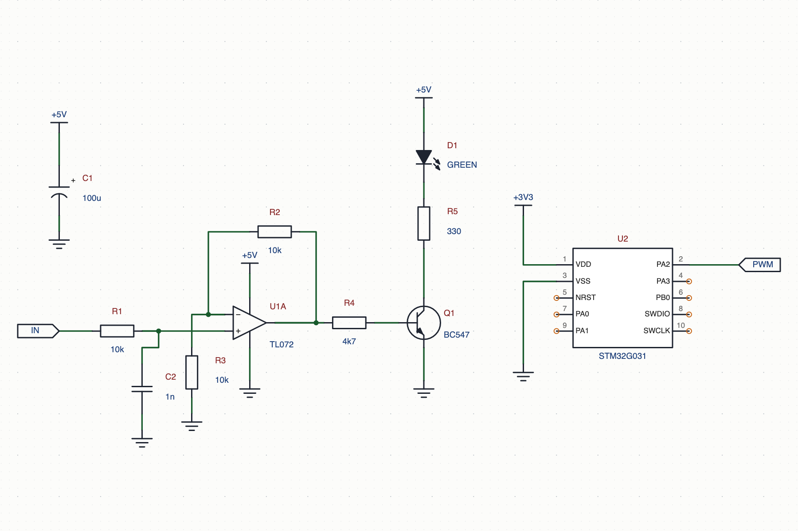

# AvaSchematic

**A schematic and diagram control for [Avalonia](https://avaloniaui.net/).** Electronic schematics,
mindmaps, flowcharts, UML and architecture drawings, on one node–port–connection core.

You say which pins are joined. It works out where every line runs, keeps two lines out of one lane, takes
them round the parts they are not wired to, and puts a junction dot exactly where three legs of a net meet.

**[Documentation, guide and API reference →](https://pavel-zheltiakov.github.io/AvaSchematic/)**

```
dotnet add package AvaSchematic --prerelease
```



---

## What is in this repository

This is the **public** repository: the documentation site and the demo application's source. The library's
own source is not here — the package on
[nuget.org](https://www.nuget.org/packages/AvaSchematic) is what this demo builds against, which is the only
honest way to find out whether the published package works.

| | |
|---|---|
| `docs/` | The site, served by GitHub Pages. Home, the guide, the API reference and the releases page. |
| `demo/` | The demo application, restoring `AvaSchematic` from nuget.org. |
| `LICENSE.md` | Freeware, commercial use included. |
| `THIRD-PARTY-NOTICES.md` | What the library and the demo build on. |

## Running the demo

```
git clone https://github.com/pavel-zheltiakov/AvaSchematic.git
cd AvaSchematic/demo
dotnet run --project AvaSchematic.Demo
```

Six sample sheets, an inspector, and every drawing rule as a switch you can turn off to see what it was
protecting.

## Fifteen lines

```csharp
var library  = SymbolLibrary.CreateDefault();
var document = new SchematicDocument(library) { GridSize = 10 };

var r1 = document.AddNodeAtPin(ElectronicSymbols.ResistorIec, "1", new Point(0, 0));
r1.Designator = "R1";
r1.Value      = "10k";

var gnd = document.AddNodeAtPin(ElectronicSymbols.Ground, "1", new Point(0, 100));
document.Connect(r1, "2", gnd, "1");

View.Document = document;
View.ZoomToFit();
```

[Chapter one](https://pavel-zheltiakov.github.io/AvaSchematic/api/your-first-schematic.html) walks through
every line of that, and assumes you have never drawn a circuit.

## Feedback

[GitHub Issues](https://github.com/pavel-zheltiakov/AvaSchematic/issues) — a bug, a missing part, a
question. In the open, where the answer helps the next person.

---

Copyright © 2026 Pavel Zheltiakov. Freeware; see `LICENSE.md` for the exact terms.
